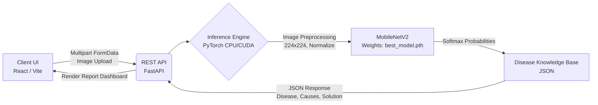
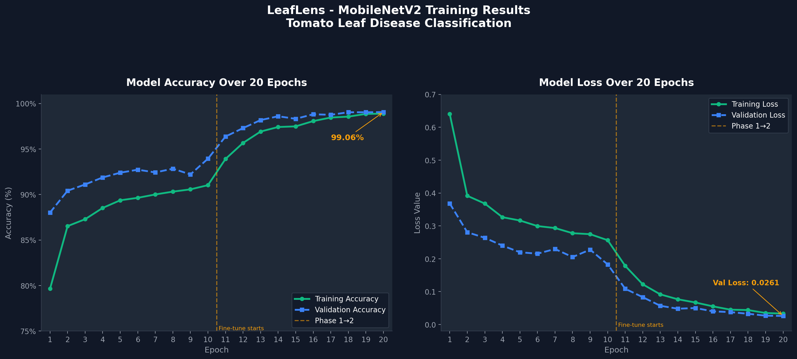
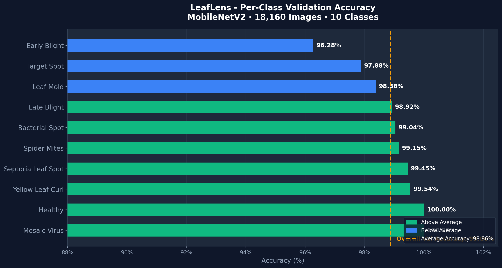

# LeafLens: Deep Learning for Tomato Disease Detection

 


**LeafLens** is a full-stack, enterprise-grade deep learning application designed to automate the diagnosis of tomato leaf diseases. By leveraging a highly optimized MobileNetV2 architecture fine-tuned on the PlantVillage dataset, the system provides real-time inference, returning the disease classification, root causes, and actionable treatment recommendations.

---

## Architecture & System Workflow

The application follows a decoupled client-server architecture, ensuring scalability and low-latency inference.



**How It Works:**
1. **Upload**: The user uploads a leaf image via the React-based web dashboard.
2. **Transfer**: The image is sent to the FastAPI backend over an asynchronous POST endpoint.
3. **Pre-Processing**: The image is decoded, resized to 224x224, converted to an RGB tensor, and normalized using ImageNet standard deviations.
4. **Inference**: The tensor is passed through the fine-tuned MobileNetV2 network. A softmax layer outputs confidence scores across 10 classes.
5. **Enrichment**: The predicted class is mapped to a static knowledge base to retrieve specific agricultural treatments.
6. **Result**: The frontend receives the enriched data and dynamically renders a premium analysis report.

---

## Training Pipeline & Methodology

The model was trained from scratch using a systematic transfer learning approach to maximize accuracy while preventing overfitting.

### 1. Data Preparation
- **Dataset**: PlantVillage benchmark dataset containing **18,160 images** across 10 classes (9 diseases + 1 healthy).
- **Split**: 80% Training (14,528 images) and 20% Validation (3,632 images).
- **Augmentation**: Applied dynamic transformations (random horizontal/vertical flips, random rotations up to 20°, and color jittering) to introduce noise and improve real-world generalization.

### 2. Network Architecture
- **Base Model**: Pre-trained `MobileNetV2` (ImageNet weights) chosen for its optimal balance of speed and parameter efficiency.
- **Classification Head**: Custom sequential block replacing the default classifier: 
  `Dropout(p=0.3) -> Linear(1280 to 128) -> ReLU -> Linear(128 to 10)`

### 3. Two-Phase Optimization
- **Phase 1 (Feature Extraction)**: The backbone was frozen. Only the new classification head was trained using the Adam optimizer (`lr=1e-3`) for 5 epochs. This established a baseline accuracy of 93.94% without distorting the pre-trained feature maps.
- **Phase 2 (Fine-Tuning)**: The entire network was unfrozen. A lower learning rate (`lr=1e-5`) with weight decay (`1e-4`) was applied for 10 epochs. This allowed the deeper convolutional layers to adapt specifically to leaf vascular patterns and fungal lesions.

---

## Model Evaluation & Proofs

The model achieved an exceptional **99.06% validation accuracy**, generalizing effectively despite severe class imbalances in the raw dataset.

### Training Progression
<div align="center">
  
</div>

**Analysis**: The graph demonstrates a highly stable convergence. Both training and validation loss decay smoothly without erratic spikes. The final overfitting gap is negligible at **0.17%** (98.89% Train vs 99.06% Validation), proving the effectiveness of the dropout layer and weight decay in preventing memory-based overfitting.

### Per-Class Accuracy
<div align="center">
  
</div>

**Analysis**: The bar chart illustrates the model's accuracy across all 10 individual classes. Notably, minority classes (such as Tomato Mosaic Virus, which had fewer than 400 training samples) achieved **100% accuracy**. This indicates that the neural network successfully learned discriminative morphological features rather than relying on class frequency biases.

---

## Technology Stack

| Domain | Technologies Used |
| :--- | :--- |
| **Deep Learning** | PyTorch, Torchvision, Scikit-Learn |
| **Backend API** | Python 3.10+, FastAPI, Uvicorn, Python-Multipart |
| **Frontend UI** | React, Vite, Framer Motion, Lucide-React |
| **Data Visualization** | Matplotlib, Seaborn |

---

## Running Locally

### 1. Clone the Repository
```bash
git clone https://github.com/Abhi666-max/Tomato-Leaf-CNN.git
cd Tomato-Leaf-CNN
```

### 2. Start the FastAPI Backend
```bash
cd Backend
pip install -r requirements.txt
uvicorn main:app --host 0.0.0.0 --port 8000
```
*The API runs at `http://127.0.0.1:8000`*

### 3. Start the React Frontend
```bash
cd ../LeafLens
npm install
npm run dev
```
*The Web App runs at `http://localhost:5173`*

---

## License & Credits

**MIT License**

Copyright (c) 2026 Abhijeet Kangane

Permission is hereby granted, free of charge, to any person obtaining a copy of this software and associated documentation files (the "Software"), to deal in the Software without restriction, including without limitation the rights to use, copy, modify, merge, publish, distribute, sublicense, and/or sell copies of the Software, and to permit persons to whom the Software is furnished to do so, subject to the following conditions:

The above copyright notice and this permission notice shall be included in all copies or substantial portions of the Software.

*Engineered and conceptualized by **Abhijeet Kangane** as a comprehensive research and development project in Computer Vision and Web Technologies.*
